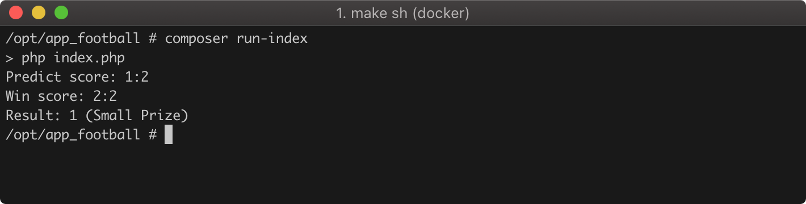
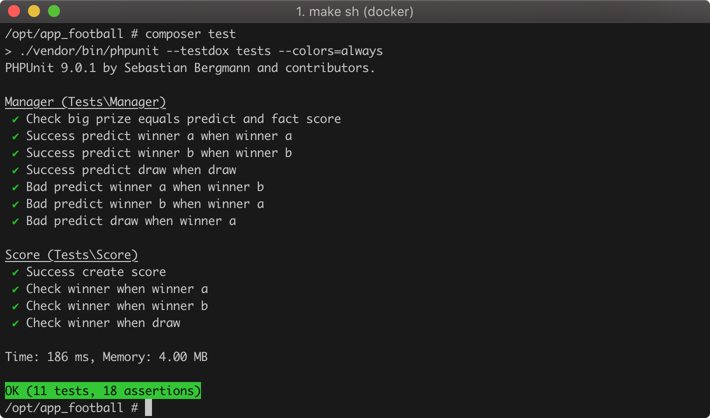

# Задача про футбол

## Постановка задачи

Две команды А и Б играют в футбол. Некто делает ставку на результат матча, например `1:2`.

По окончании матча становится известен настоящий счет, и нам надо выдать тот или иной приз. Если некто угадал точный счет - он получает большой приз. Если некто угадал исход матча (выигрыш той или иной команды, или же ничью) - он получает маленький приз. если же он не угадал - он получает нудевой приз.

Необходимо написать функцию на вашем любимом языке программирования, которая принимает в качестве аргументов предполагаемый счет и реальный счет, и возвращает целое число `0`, `1` или `2` (нулевой, маленький или большой приз).

## Как запустить

- Установить php 7.4
- Устанвоить composer
- Запустить команду `composer install`
- Запустить тесты `composer run-index`

## Как запустить тесты

- Установить php 7.4
- Устанвоить composer
- Запустить команду `composer install`
- Запустить тесты `composer test`

